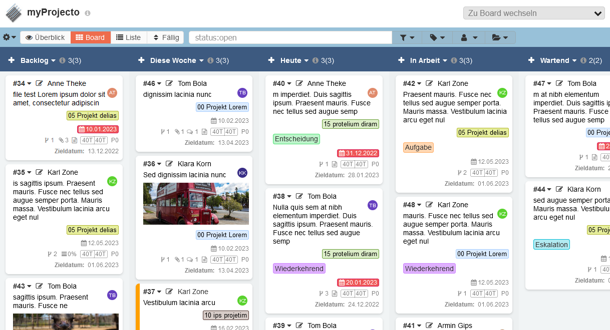
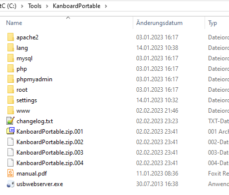
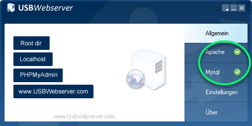
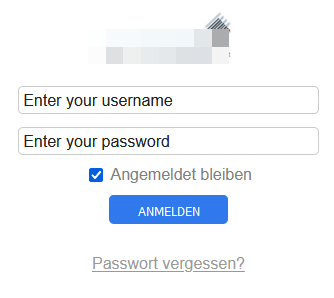
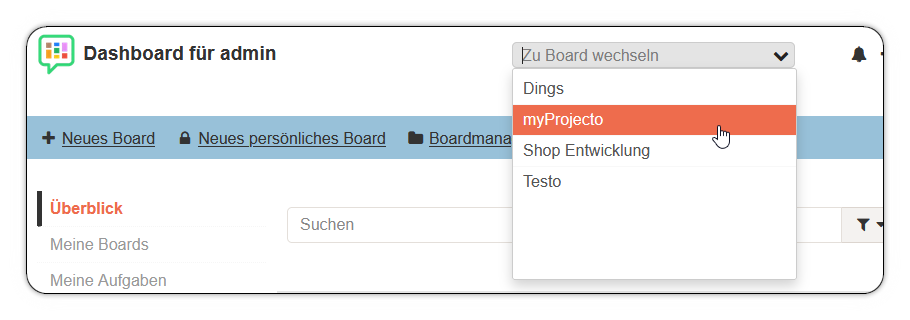

 Use the table of contents

 

**:star: If you use it, you should star it on GitHub!** *It's the least you can do for all the work put into it!*

*Englisch Text Version yet to come.... stay tuned*

Portable Kanboard (Windows)
=============================

Willkommen zur portablen Version des Kanban Tools *Kanboard*. 

Das Paket besteht aus folgenden Teilen:

## USBWebserver V8.6

Ein Freewaretool für das Starten, Stoppen und Verwalten eines Apache Webserver und einer MySQL Datenbankserver Instanz.

Geschrieben von Leon de Vries mit Design von Bart Boerendans

Lizenz: Freeware / Open Source Software

Mehr Informationen: https://www.usbwebserver.net/webserver/

Dokumenation (englisch): https://www.usbwebserver.net/downloads/manual.pdf

## Apache V2.4.52

Lizenz:	Apache License 2.0

Mehr Informationen: https://httpd.apache.org/

## MySQL Server 5.6

Lizenz: GNU GPL Version 2

Mehr Informationen: https://www.mysql.com/

## php 8.1.3 x86 VC C++ 2019

Mehr Informationen: https://www.php.net/

## phpMyAdmin 11.02.2022

Lizenz: GNU GPL Version 2

Mehr Informationen: https://www.phpmyadmin.net/

| Zugangsdaten |                             |
| ------------ | --------------------------- |
| Link         | http://localhost/phpmyadmin |
| User         | root                        |
| Passwort     | usbw                        |

Diese portable Kanboard Version verwendet das dateibasierend SQLite3. MySQL ist hier nur dabei, weil es zum USBWebserver Package gehört.

Wenn bei der Anmeldung eine Fehlermeldung erscheint: Im Browser ein *reload* durchführen und noch einmal anmelden. Das liegt daran, dass die DB Files (initial ca. 80 MB) noch nicht angelegt waren, um das Archiv möglichst klein zu halten.

## Kanboard V 1.2.25

Lizenz: MIT Lizenz

Mehr Informationen: https://kanboard.org/

Mitwirkende: https://github.com/kanboard/kanboard/graphs/contributors

| Zugangsdaten |                                                              |
| ------------ | ------------------------------------------------------------ |
| Link         | http://localhost/?controller=BoardViewController&action=show&project_id=6 |
| User         | admin                                                        |
| Passwort     | admin!                                                       |

### Enthaltende Kanboard PlugIns

[Boardcustomizer](https://github.com/BlueTeck/kanboard_plugin_boardcustomizer)

Erlaubt es verschiedene Einstellungen für die Anzeige auf Benutzerlevel vorzunehmen. z. B. das Ausblenden von Icons auf den Task-Karten.

[ColorManager](https://github.com/aljawaid/ColorManager)

Basic PlugIn. Stellt zahlreiche Farboptionen für Tags, Kategorien und Karten zur Verfügung.

[Coverimage](https://github.com/BlueTeck/kanboard_plugin_coverimage)

Erlaubt es Bilder in Tasks auf den Karten anzuzeigen.

[Customizer](https://github.com/creecros/Customizer)

Individualisierung von Kanboard. Login Screen. Favicons und mehr. Branding.

[CustomUserCSS](https://github.com/PapeCoding/kanboard-CustomUserCSS)

Erlaubt es benutzerbezogen eigenes CSS zu verwenden. Optional. Hier enthalten.

[DueDate](https://github.com/JustFxDev/kanboard-duedate)

Schnelles Umschalten der Anzeige der Tasks auf dem Board nach dem ursprünglichen Anlegen, dem Fälligkeitsdatum oder der letzten Änderung der Aufgaben / Tasks / Karten.

[EnableAttachmentRenaming](https://github.com/Chaosmeister/EAR)

Basic. Erlaubt es Attachments umzubenennen.

[GrabScroll](https://github.com/psy-q/kanboard-plugin-grabscroll)

Durch Klicken und Festhalten in einem freien Bereich auf dem Board kann das Board nach Links und Rechts bewegt werden.

[KanboardCommentActions](https://github.com/ipunkt/KanboardCommentActions)

Basic. Erlaubt es direkt unter dem Kommentareingabefeld eine neue Zuweisung an eine Verantwortliche zu definieren.

[KanboardPermalink](https://github.com/theobald-software/KanboardPermalink)

Nice to have. Im Taskmenü der Karte befindet sich ein Link der einen permanenten Link zu diesem Task in die Zwischenablage kopiert.

[MarkDownPlus](https://github.com/creecros/MarkdownPlus)

Erlaubt es [Markdown Features](https://www.markdownguide.org/basic-syntax/) in Kommentaren und Beschreibungen zu verwenden. z. B. Emojis, Checkboxen und Unicode Umsetzungen.

[metaMagik](https://github.com/creecros/MetaMagik)

Basic: Erlaubt es eigene Felder zu lokal zu Boards oder global zur Instanz hinzuzufügen. Inkl. Typisierung (Datum z. B. mit Datumsauswahlbox)

[PasteImageToMarkdown](https://github.com/Chaosmeister/PITM)

Benötigt MarkDownPlus (s. o.) und erlaubt es Bilder in Eingabeboxen hinzuzufügen.

[Taglist](https://github.com/BlueTeck/kanboard_plugin_taglist)

Basic: Fügt einen Button in die Filterleiste hinzu der es erlaubt nach Tags zu filtern. Auf Tastendruck.

[Task2PDF](https://github.com/creecros/Task2pdf)

Druckt Tasks als PDF aus. 

[ThemeMaestro](https://github.com/JustFxDev/ThemeMaestro)

Theme für Kanboard. Wichtig: Kanboard unterstützt aktuell nur ein Theme per Installation. Wenn mehrere Themes im PlugIn Verzeichnis vorliegen, dann kommt es zu unerwarteten Seiteneffekten.

[OverrideTranslation](https://github.com/BlueTeck/kanboard_plugin_overwrite_translation)

Ein Tool das es erlaubt alle Übersetzungen, auch die die im Core verwendet werden, mit eigenen zu überschreiben. 

## Vorteile
- Benötigt **keine Administrator Rechte** (im Gegensatz zu xampp)
- Läuft ohne Installation, auch von einem USB Stick
- kpl. vorkonfiguriert inkl. einige als Basics eingeschätzte PlugIns
- Demo Board enthalten
- Das Web Verzeichnis (www) kann 1:1 einfach auf einen Webserver im Internet verschoben und betrieben werden (Achtung: der Server und die Applikation sollten entsprechend abgesichert werden) Ggf. sind php Vorraussetungen zu beachten. In der Regel sollte das aber so sofort laufen. Kommt auf den Webhoster an.
- Das "www" Verzeichnis kann auch auf anderen Betriebssystemen verwendet werden, wenn man dort einen lokalen Webserver installiert hat. Einfach 1:1 kopieren
- MySQL ist **nicht** erforderlich. Das Package arbeitet mit dem dateibasierenden SQLite3. MySQL ist enthalten, aber nicht in Verwendung. Kanboard kann auch so eingerichtet werden, dass es MySQL verwendet (oder Progress oder MS-SQL).
- Zu Testzwecken
- Oder als persönliches, lokales System (oder mobil auf einem USB Stick)
- Das Webbackend kann auch für andere Systeme genutzt werden. WordPress lokal mit MySQL? Kein Problem...
- phpMyAdmin als Datenbank Administrationsoberfläche ist ebenfalls enthalten (für diese Kanboard Konfiguration nicht relavant, da SQLite3 verwendet wird)

## Schnellstart

Zip File des Pakets herunterladen und entpacken. Zielordner spielt keine Rolle. Empfehlung: keine Leerzeichen im Gesamtverzeichnisnamen. Nicht zu tief verzweigt. Beispiel:

c:\tools\kanboardportable

Nachdem das Archiv entpackt wurde reicht es die `usbwebserver.exe` auszuführen. Wenn das ohne Probleme geklappt hat, dann sollte das wie folgt angezeigt werden:

MySQL benötigen wir nicht, aber der Apache Server sollte einen grünen Haken aufweisen. Nach dem Start der Serverkomponenten wird automatisch auch der lokale Browser gestartet, der dann die Kanboard Anmeldung anzeigt:

Die Anmeldedaten lauten wie folgt:

- Name: **admin**

- Passwort: **admin!**

Für den Einstieg kann dann das Beispielprojekt *myProjekto* ausgewählt werden:

oder alternativ dieser Link verwendet werden: http://localhost/?controller=BoardViewController&action=show&project_id=6

## Tipps

- Wenn die Konfiguration von php oder Apache geändert werden soll: die entsprechenden Dateien liegen unter C:\Tools\KanboardPortable\\**settings** Die Dateien werden von dort beim Start des USBWebservers an die eigentlichen Stellen der anderen Programme kopiert. Es macht also keinen Sinn im php oder apache oder sonstigen Verzeichnissen Änderungen vorzunehmen. 
- Das Webserver Package ist auch für alle sonstigen Systeme geeignet, die auf Apache und MySQL aufbauen (WordPress, DokuWiki, etc. pp.)
- Es läuft ohne Admin Rechte (im Gegensatz zum xampp Package)
- Das Verzeichnis `www` enhält alles was Kanboard zum Betrieb benötigt
- Wer andere webbasierende $Dinge verwenden möchte sollte unterhalb von `www`ein entsprechendes Verzeichnis anlegen und alles dort ablegen. z. B. *wordpress* Danach kann das via http://localhost/wordpress angesteuert werden

Autor
------

- Fx

- Die im Demoboard enthaltenen Bilder unterliegen folgender Lizenz: *CC-BY-SA 3.0 by Fx*

- Unterstützung für dieses Projekt ist herzlich willkommen!

  

