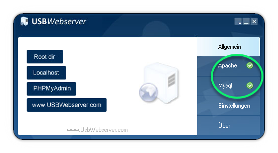
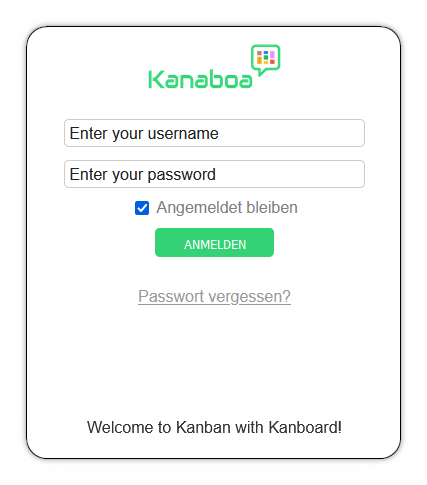

 Use the table of contents

 

**:star: If you use it, you should star it on GitHub!** *It's the least you can do for all the work put into it!*

:de: [Deutsche Fassung dieses Textes](./README_de.md)

Portable Kanboard (Windows)
=============================

Welcome to the portable version of the Kanban Tool *Kanboard*. 

## Quick start

Download the latest version of [KanboardPortable.zip](https://github.com/JustFxDev/Portable-Kanboard-and-Webserver/releases) from the release section and unpack the archive. The destination folder does not matter. Recommendation: no spaces in the overall directory name. Do not branch too deeply. Example:

c:\tools\kanboardportable

After the archive has been unpacked, it is sufficient to execute `usbwebserver.exe`. If this worked without problems, it should be displayed as follows:

We do not need MySQL, but the Apache server should have a green tick. After starting the server components, the local browser is also started automatically, which then displays the Kanboard login:

The login details are as follows:

- Name: **admin**

- Password: **admin!**

The example project *myProjekto* can then be selected to get started:

or alternatively this link can be used: http://localhost/?controller=BoardViewController&action=show&project_id=6

## What is included?

The package consists of the following parts:

## USBWebserver V8.6

A freeware tool for starting, stopping and managing an Apache web server and a MySQL database server instance.

Written by Leon de Vries with design by Bart Boerendans

Licence: Freeware / Open Source Software

More information: https://www.usbwebserver.net/webserver/

Documentation: https://www.usbwebserver.net/downloads/manual.pdf

## Apache V2.4.52

Licence:	Apache License 2.0

More information: https://httpd.apache.org/

## MySQL Server 5.6

Licence: GNU GPL Version 2

More information: https://www.mysql.com/

## php 8.1.3 x86 VC C++ 2019

More information: https://www.php.net/

## phpMyAdmin 11.02.2022

Licence: GNU GPL Version 2

More information: https://www.phpmyadmin.net/

| Access data |                             |
| ------------ | --------------------------- |
| Link         | http://localhost/phpmyadmin |
| User         | root                        |
| Password     | usbw                        |

This portable Kanboard version uses the file-based SQLite3. MySQL is only included here because it is part of the USBWebserver package.

If an error message appears when you log in for the first time: Perform a *reload* in the browser and log in again. This is because the DB files (initially approx. 80 MB) have not yet been created.

## Kanboard V 1.2.25

Licence: MIT Licence

More information: https://kanboard.org/

Contributors: https://github.com/kanboard/kanboard/graphs/contributors

| Access data  |                                                              |
| ------------ | ------------------------------------------------------------ |
| Link         | http://localhost/?controller=BoardViewController&action=show&project_id=6 |
| User         | admin                                                        |
| Password     | admin!                                                       |

### Included Kanboard PlugIns

[Boardcustomizer](https://github.com/BlueTeck/kanboard_plugin_boardcustomizer)

Allows various settings to be made for the display at user level, e.g. hiding icons on the task cards.

[ColorManager](https://github.com/aljawaid/ColorManager)

Basic PlugIn. Provides numerous colour options for tags, categories and cards.

[Coverimage](https://github.com/BlueTeck/kanboard_plugin_coverimage)

Allows pictures to be displayed in tasks on the maps.

[Customizer](https://github.com/creecros/Customizer)

Individualisation of Kanboard. Login screen. Favicons and more. Branding.

[CustomUserCSS](https://github.com/PapeCoding/kanboard-CustomUserCSS)

Allows you to use your own user-specific CSS. Optional. Included here.

[DueDate](https://github.com/JustFxDev/kanboard-duedate)

Quickly switch the display of tasks on the board according to the original creation, due date or last modification of the tasks / cards.

[EnableAttachmentRenaming](https://github.com/Chaosmeister/EAR)

Basic. Allows attachments to be renamed.

[GrabScroll](https://github.com/psy-q/kanboard-plugin-grabscroll)

By clicking and holding in a free area on the board, the board can be moved left and right.

[KanboardCommentActions](https://github.com/ipunkt/KanboardCommentActions)

Basic. Allows a new assignment to a responsible person to be defined directly below the comment input field.

[KanboardPermalink](https://github.com/theobald-software/KanboardPermalink)

Nice to have. In the task menu of the map there is a link that copies a permanent link to this task to the clipboard.

[MarkDownPlus](https://github.com/creecros/MarkdownPlus)

Allows [Markdown Features](https://www.markdownguide.org/basic-syntax/) to be used in comments and descriptions. e.g. emojis, checkboxes and Unicode conversions.

[metaMagik](https://github.com/creecros/MetaMagik)

Basic: Allows custom fields to be added locally to boards or globally to the instance. Incl. typing (date e.g. with date selection box)

[PasteImageToMarkdown](https://github.com/Chaosmeister/PITM)

Requires MarkDownPlus (see above) and allows images to be added to input boxes.

[Taglist](https://github.com/BlueTeck/kanboard_plugin_taglist)

Basic: Adds a button to the filter bar that allows filtering by tags. At the touch of a button.

[Task2PDF](https://github.com/creecros/Task2pdf)

Prints tasks as a PDF. 

[ThemeMaestro](https://github.com/JustFxDev/ThemeMaestro)

Theme for Kanboard. Important: Kanboard currently supports only one theme per installation. If there are several themes in the plug-in directory, unexpected page effects may occur.

[OverrideTranslation](https://github.com/BlueTeck/kanboard_plugin_overwrite_translation)

A tool that allows you to overwrite all translations, even those used in the core, with your own. 

## Advantages
- Requires **no administrator rights** (unlike xampp)
- Runs without installation, even from a USB stick
- Completely pre-configured incl. some plug-ins that are considered basics
- Demo board included
- The web directory (www) can simply be moved 1:1 to a web server on the internet and operated (Attention: the server and the application should be secured accordingly). As a rule, however, this should work immediately. Depends on the web hoster.
- The "www" directory can also be used on other operating systems if you have installed a local web server there. Simply copy 1:1
- MySQL is **not** required. The package works with the file-based SQLite3. MySQL is included but not in use. Kanboard can also be set up to use MySQL (or Progress or MS-SQL).
- For test purposes
- Or as a personal, local system (or mobile on a USB stick)
- The web backend can also be used for other systems. WordPress locally with MySQL? No problem...
- phpMyAdmin as database administration interface is also included (not relevant for this Kanboard configuration as SQLite3 is used).
- Together with Visual Studio Code, an optimal package for developers who contribute to the core or write and improve plug-ins.

## Tips

- If the configuration of php or Apache is to be changed: the corresponding files are located under C:\Tools\KanboardPortable\\**settings** The files are copied from there to the actual locations of the other programmes when the USB web server is started. It therefore makes no sense to make changes in the php or apache or other directories.
- The web server package is also suitable for all other systems that are based on Apache and MySQL (WordPress, DokuWiki, etc. pp.).
- It runs without admin rights (unlike the xampp package)
- The directory `www` contains everything that Kanboard needs to operate.
- If you want to use other web-based $things you should create a directory under `www` and put everything there. e.g. *wordpress* Then you can access it via http://localhost/wordpress.

Contributors
------

- Fx - Author

- ThomasFis - Translations

- The images contained in the Demoboard are subject to the following licence: *CC-BY-SA 3.0 by Fx*

- Support for this project is most welcome

  

